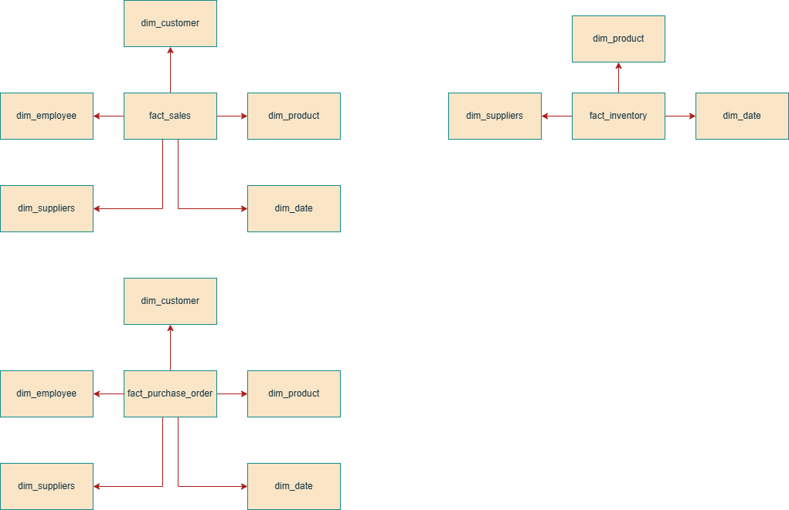
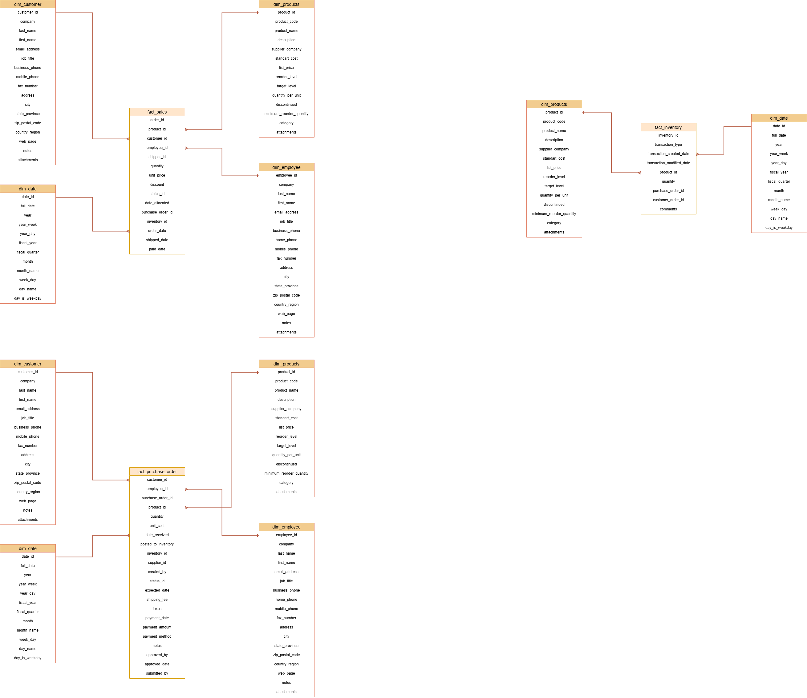
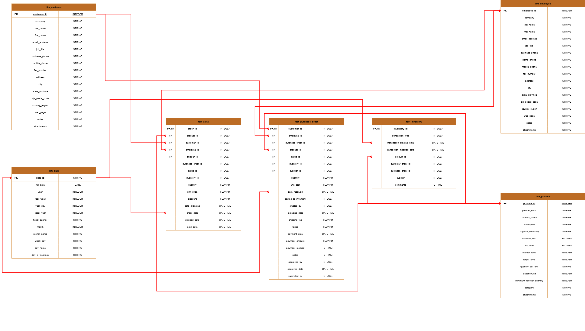

# Dimensional Data Modelling with dbt

### Info

A dimensional data modeling application suitable for various business needs was implemented using the Northwind Traders database prepared by Microsoft.

Respectively
Conceptual -> Logical -> Physical
The modeling stages were drawn through draw.io and the physical implementation was realized through dbt.

I've buildid this model at WSL and used virtual enviroment.

### Summary

It all starts with Northwind traders needing a data warehouse for their analytical needs. We position ourselves as data engineers who come together with business partners (may be a department of the company). 

- The performance of their products sold,
- Stock management of the products they purchase,
- Performance of their employees
and we realize that they want to measure it. After establishing our conceptual model together with business partners and clarifying their requests, we move on to logical and physical modeling stages respectively.

Here are the important outputs that I realized while doing the work:

- In fact, data modeling means understanding the business, organizing the appropriate data and delivering it to the end users in the most efficient, accurate, secure and fast way, rather than a set of applications.
- Therefore, I recommend that you look at this application as a blueprint for the data modeling that you will build yourself, rather than technical terminology. I am sure that as long as you look at it this way, technical details will only remain as details.

Good work to all of you!

### Dimensional Data Modelling Phases

- Conceptual Phase  
  

- Logical Phase  
  

- Physical Phase  
  